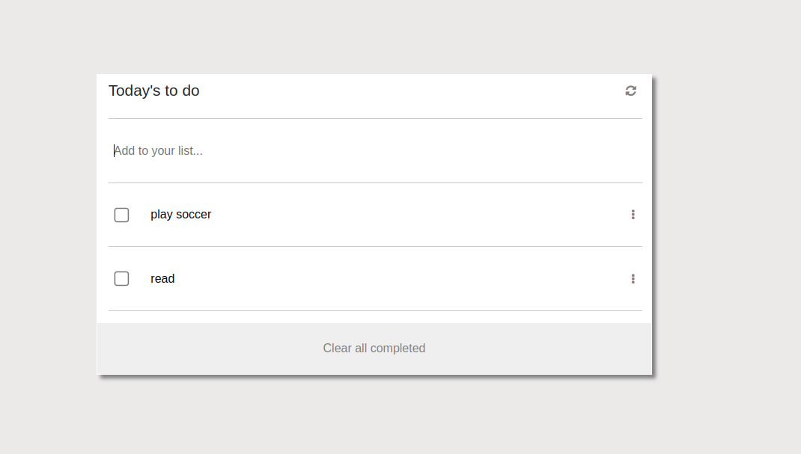

# TO-DO-LIST

> The purpose of this project is to create a web page application that has a to-do list,when the user adds items the list is generated and displayed on the page. We use webpack javascript and basic html and css.

## Built With

- HTML, CSS, JAVASCRIPT & WEBPACK

## ScreenShot Demo

## Live Demo (if available)

[https://lyangend.github.io/TO-DO-LIST/]

## Getting Started
To get a local copy and run:
git@github.com:LYANGEND/TO-DO-LIST.git in your terminal.

👤 **Author**

- GitHub: [@githubhandle](https://github.com/LYANGEND)
- Twitter: [@twitterhandle](https://twitter.com/david_lyangenda)
- LinkedIn: [LinkedIn](https://www.linkedin.com/in/david-lyangenda-623087151/)

## Show your support

Give a ⭐️ if you like this project!

## Acknowledgments

- Hat tip to anyone whose code was used
- Inspiration
- etc

## 📝 License

This project is [MIT](./MIT.md) licensed.
